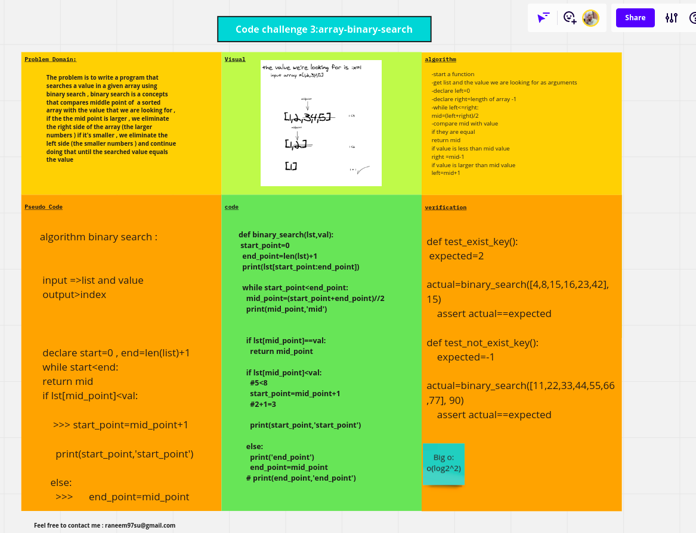
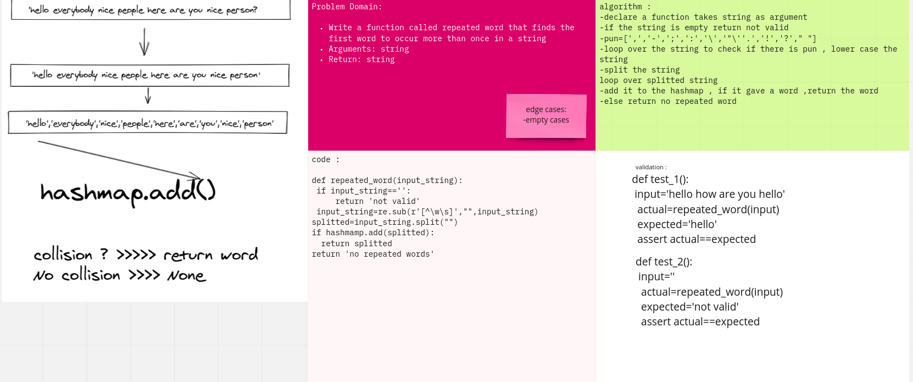
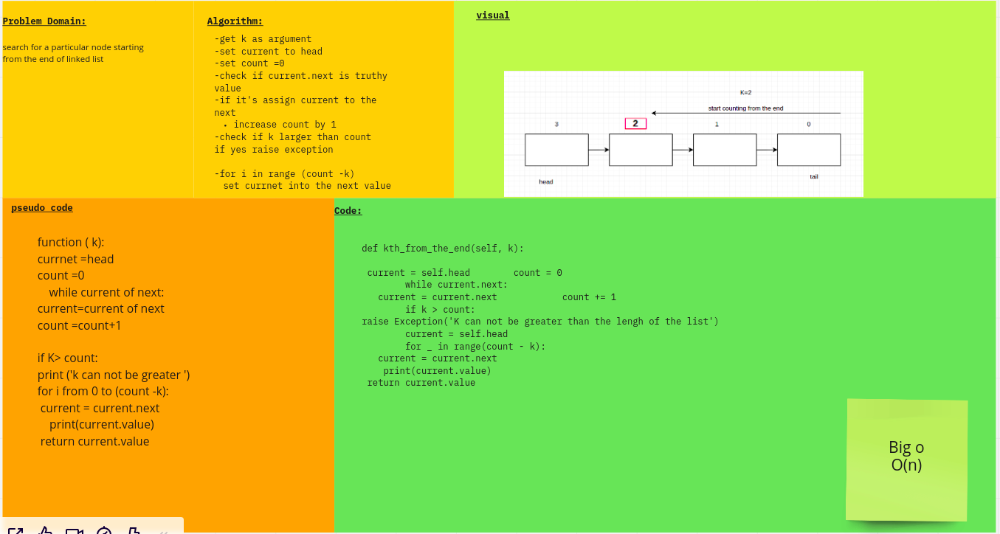

# Data-Structures-Algorithms-Review
videos : 
https://www.youtube.com/watch?v=r1MXwyiGi_U
https://www.youtube.com/watch?v=zHczhZn-z30
https://www.youtube.com/watch?v=FowJZqVggCU

top ten algorithms :

1- depth first search >graph , tree >>use stack
2- breadth first search >the difference is order of nodes >queue
3- matching brackets >stacks . recursion (more complicated) 
4- hash tables use > matrix visit the matrix , to keep track of the matrix > you should use hashtables ,fibunachi , array sum (cashing ,memozizations)

5-reversing linked list
7-sorting fundimentals :understand the time space complixity >>nlog(n)
8-Recursion 
9-custom datastructure 
10-oop
11-Binary Search time space complexcity log(n)
12-quick sort 

techniques:

variable pointers manipulation : you're traversing a string in parallel from left to right and right to left (one faster than the other) 
example : longest palindromic substring in a string 

------------------------------------------------------------------------------
- think and understand each question even you know it 
- don't wast time
- plan before code 
- when you have a solution in mind , say it and thing about more optimal one
- code in one time 

